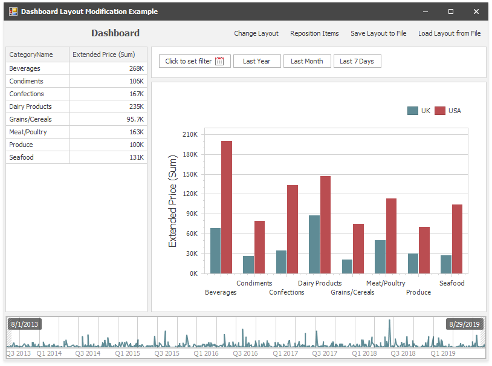

# How to Modify Dashboard Layout in Code

The following example demonstrates how to modify <a href="https://docs.devexpress.com/Dashboard/116693/main-features/dashboard-layout">dashboard layout</a> in code.

This example constructs the layout of a sample dashboard that contains the following items:

* [DateFilterDashboardItem](https://docs.devexpress.com/Dashboard/DevExpress.DashboardCommon.DateFilterDashboardItem)
* [ChartDashboardItem](https://docs.devexpress.com/Dashboard/DevExpress.DashboardCommon.ChartDashboardItem)
* [DashboardItemGroup](https://docs.devexpress.com/Dashboard/DevExpress.DashboardCommon.DashboardItemGroup) that contains the DateFilter and Chart items
* [GridDashboardItem](https://docs.devexpress.com/Dashboard/DevExpress.DashboardCommon.GridDashboardItem)
* [RangeFilterDashboardItem](https://docs.devexpress.com/Dashboard/DevExpress.DashboardCommon.RangeFilterDashboardItem)

The [Dashboard.LoadFromXml](https://docs.devexpress.com/Dashboard/DevExpress.DashboardCommon.Dashboard.LoadFromXml(System.String)) method loads a sample dashboard. 

The following steps are taken to create a new layout:

1. Create [DashboardLayoutItem](https://docs.devexpress.com/Dashboard/DevExpress.DashboardCommon.DashboardLayoutItem) objects to display the existing dashboard items and [DashboardLayoutGroup](https://docs.devexpress.com/Dashboard/DevExpress.DashboardCommon.DashboardLayoutGroup) object to display a dashboard group. The weight parameter specifies the layout item's relative size in a group.
2. Create [DashboardLayoutGroup](https://docs.devexpress.com/Dashboard/DevExpress.DashboardCommon.DashboardLayoutGroup) objects to organize items which do not belong to a dashboard group item. Add layout items as child nodes to form a layout tree.
3. Create a root group - a new [DashboardLayoutGroup](https://docs.devexpress.com/Dashboard/DevExpress.DashboardCommon.DashboardLayoutGroup) object whose [DashboardLayoutGroup.DashboardItem](https://docs.devexpress.com/Dashboard/DevExpress.DashboardCommon.DashboardLayoutGroup.DashboardItem) property is _null_. Add the layout tree nodes to the root as its child nodes.
4. Assign the root group to the [Dashboard.LayoutRoot](https://docs.devexpress.com/Dashboard/DevExpress.DashboardCommon.Dashboard.LayoutRoot) property.

This example also demonstrates how to use the [DashboardLayoutNode.MoveRight](https://docs.devexpress.com/Dashboard/DevExpress.DashboardCommon.DashboardLayoutNode.MoveRight.overloads) method to swap layout items, save and restore the layout with the [SaveDashboardLayout](https://docs.devexpress.com/Dashboard/DevExpress.DashboardWin.DashboardViewer.SaveDashboardLayout(System.String)) and [LoadDashboardLayout](https://docs.devexpress.com/Dashboard/DevExpress.DashboardWin.DashboardViewer.LoadDashboardLayout(System.String)) methods.

**See also:**

* [Dashboard Layout](https://docs.devexpress.com/Dashboard/15617)
* [Designing Dashboard Items](https://docs.devexpress.com/Dashboard/12141)